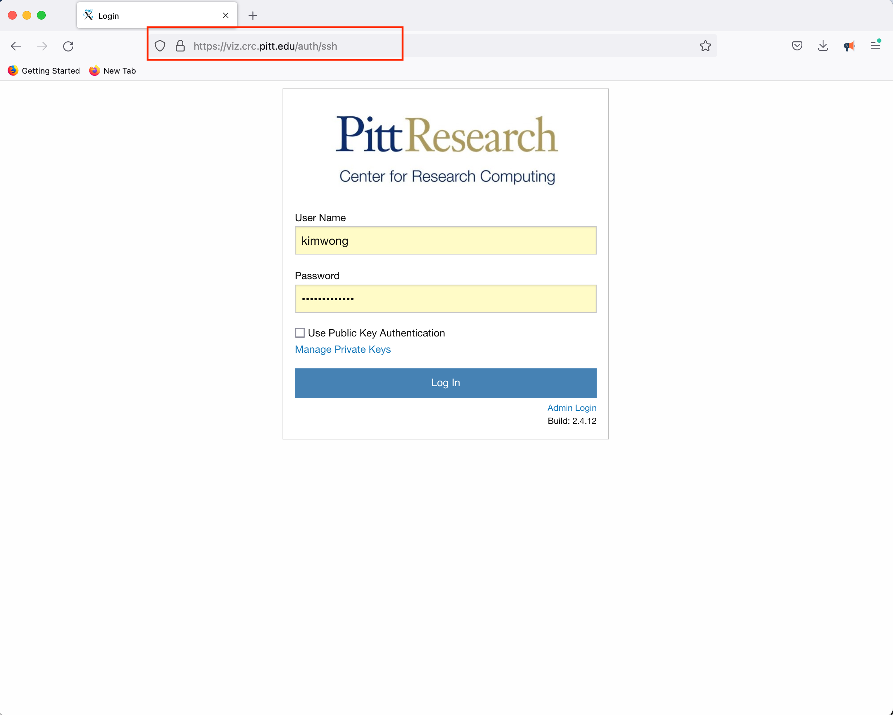
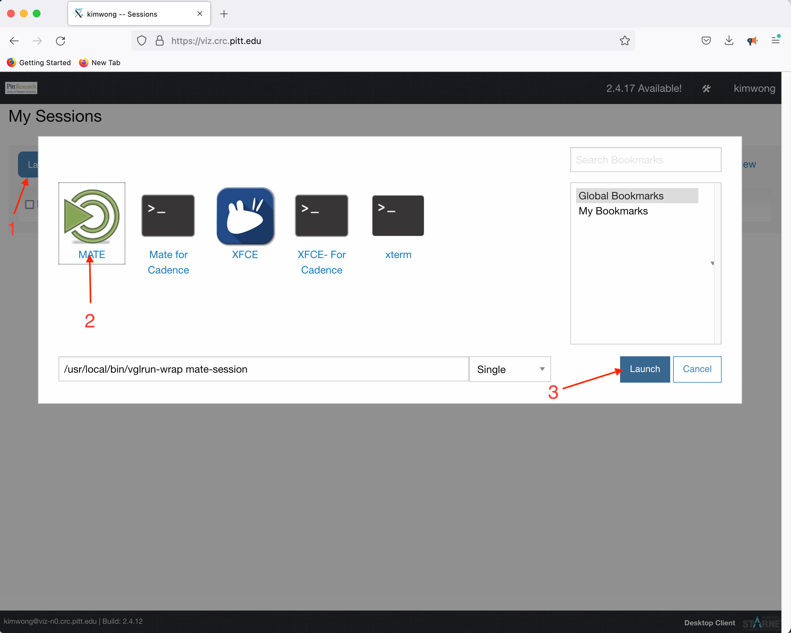
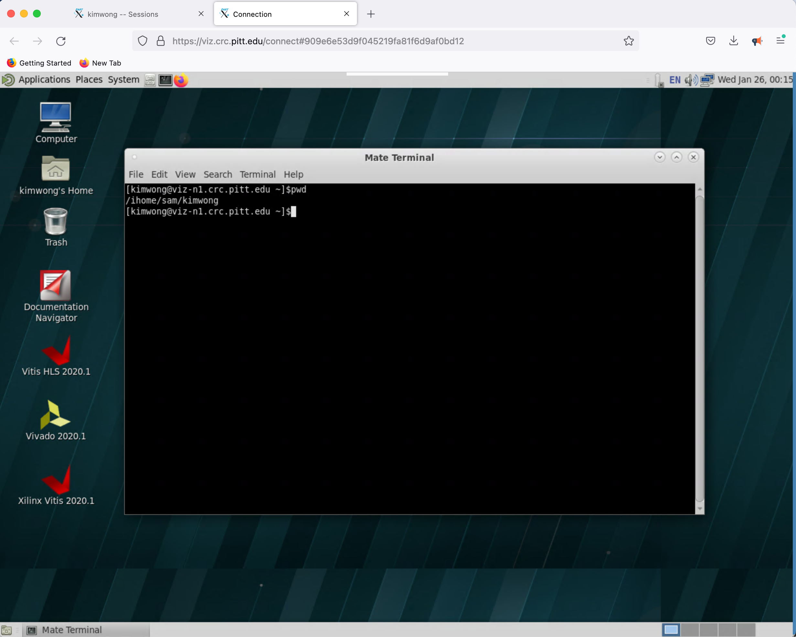
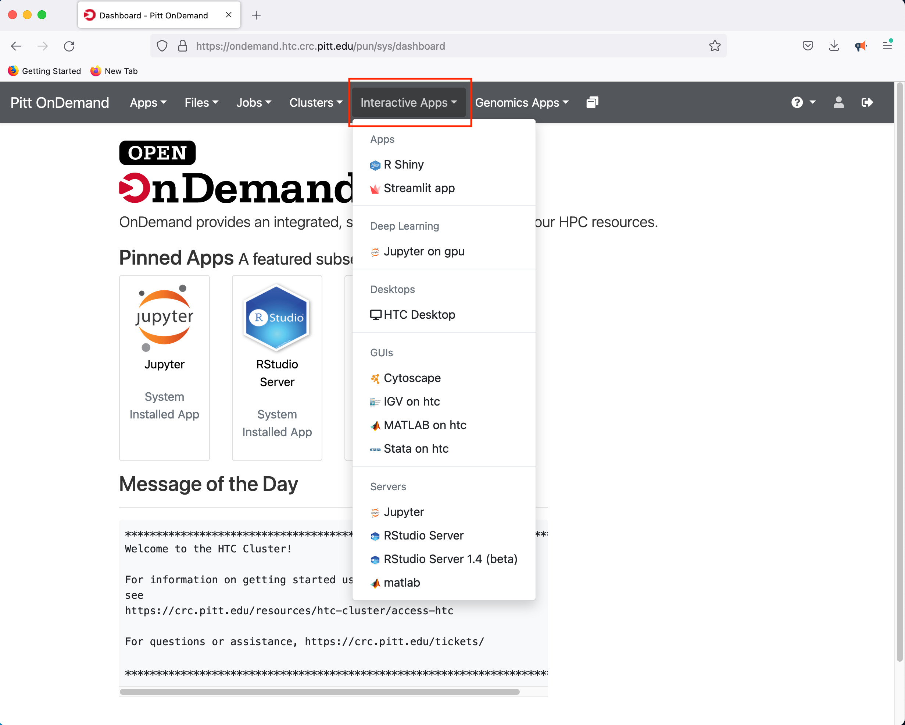
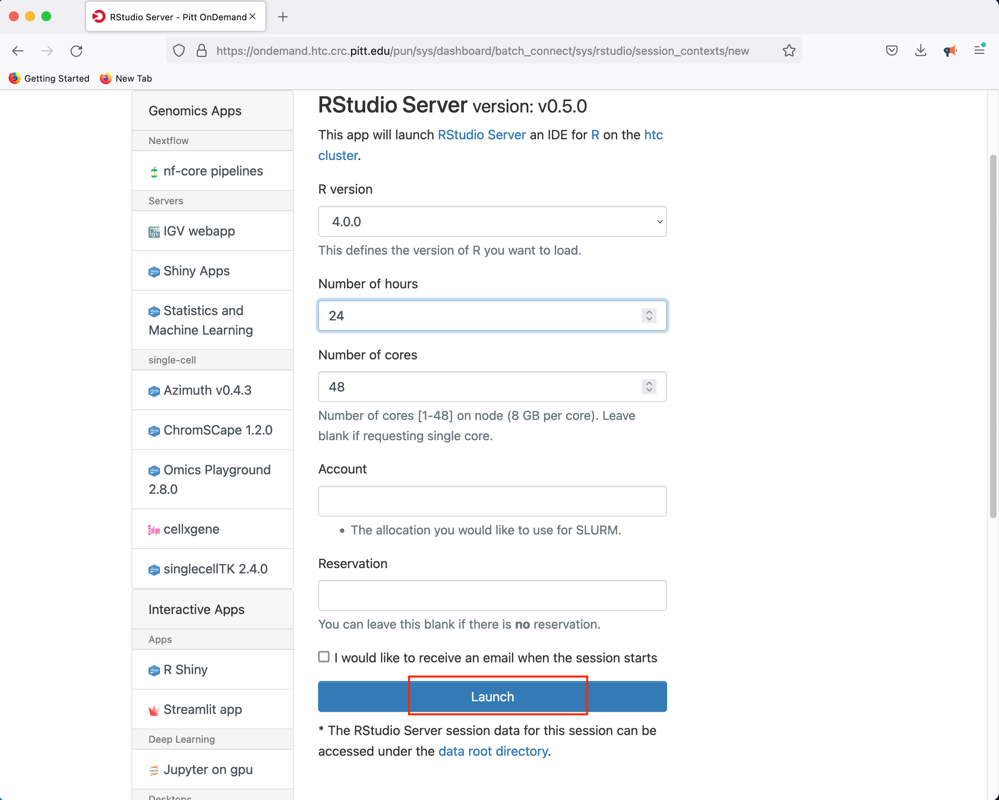
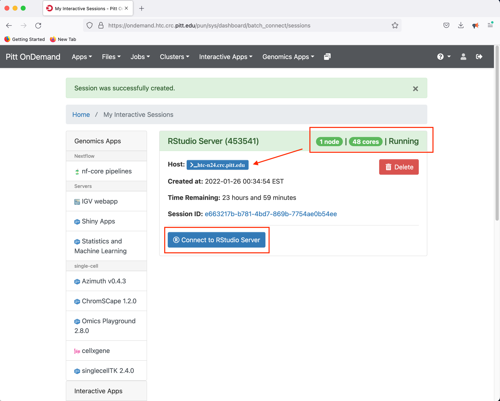
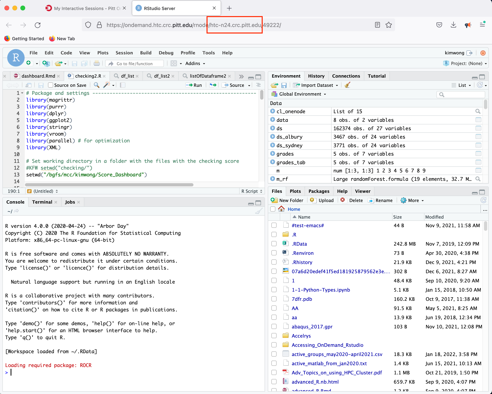
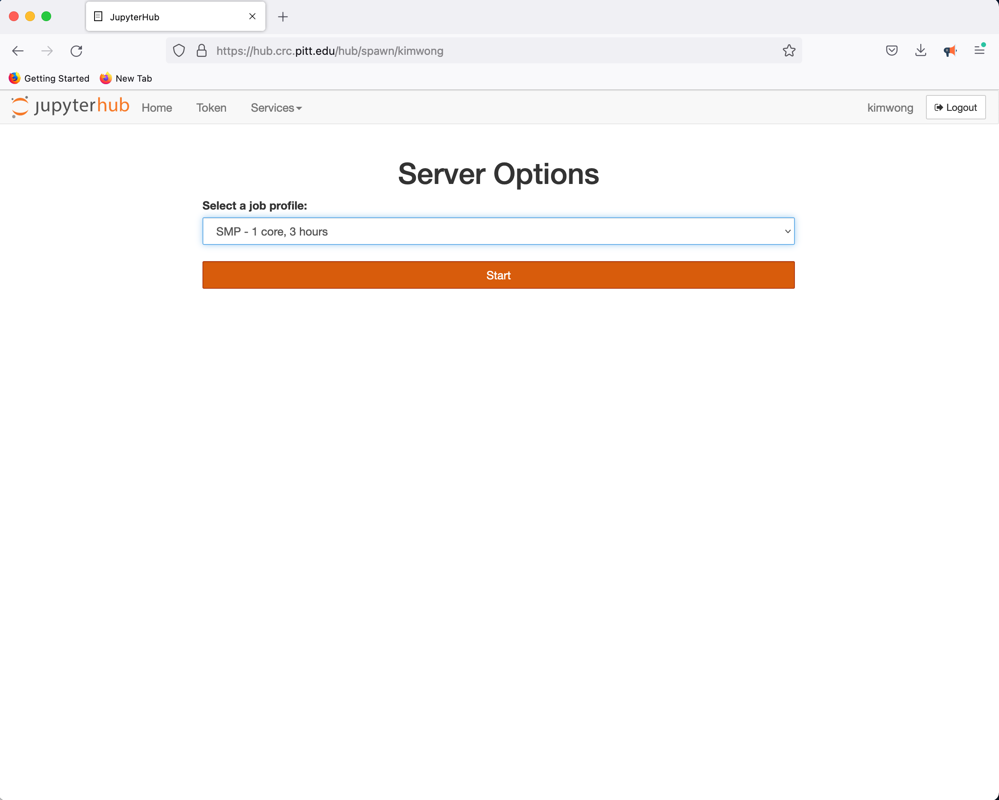
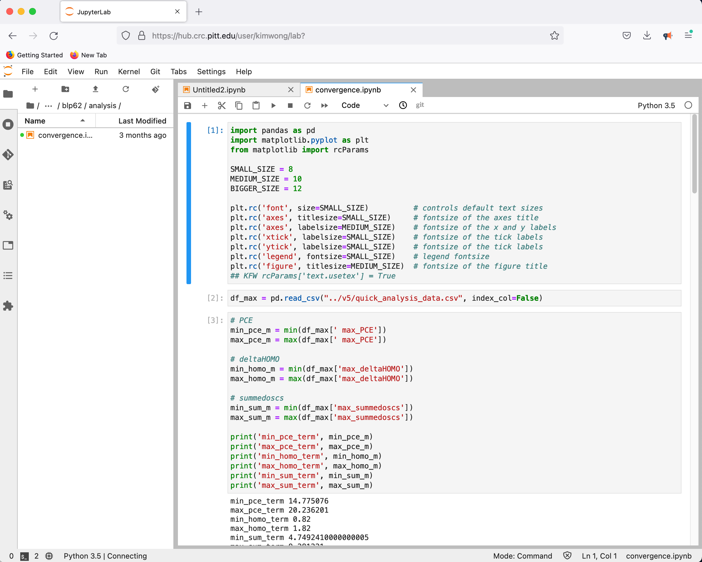
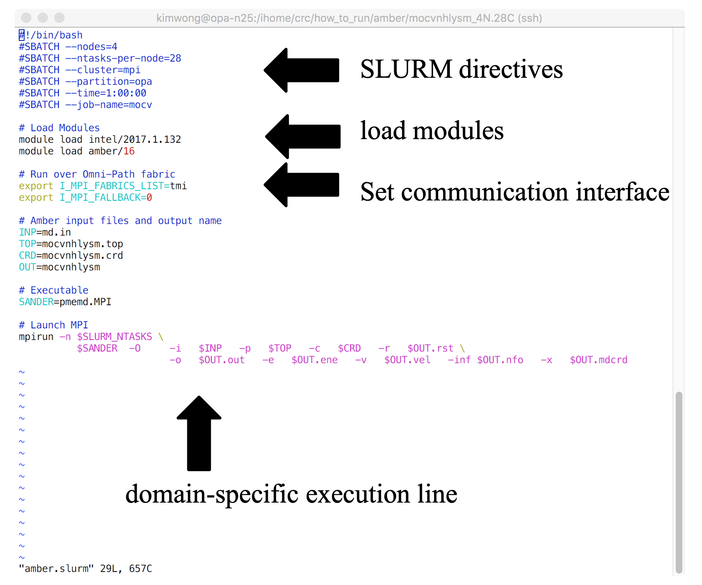

author: Kim F. Wong
summary: CRC H2P Cluster User Guide
id: docs
categories: codelab,markdown
environments: Web
status: Published
#feedback link: https://github.com/Mrc0113/codelab-4-codelab

# CRC H2P Cluster User Guide

## Overview of CRC

#### Mission
The Center for Research Computing supports leading-edge research with free access to advanced computing hardware and software for fields 
across the entire research community, along with training and consultation by CRC research faculty. CRC offers the following services:

* Access to cutting-edge computer hardware and software for enabling transformative research
* Workshops teaching the most effective ways to use Pitt CRC's computing resources
* Personalized consultation on refining projects at the computational code or workflow level 

<br>


**Resources:**
* Website: [https://crc.pitt.edu](https://crc.pitt.edu)
* Getting Started: [https://crc.pitt.edu/getting-started](https://crc.pitt.edu/getting-started)
* User Support: [https://crc.pitt.edu/UserSupport](https://crc.pitt.edu/UserSupport)


## The Ecosystem

Here is a schematic of all the key parts of the advanced computing infrastructure. The users' computer is the Client. h2p.crc.pitt.edu is 
the remote login server. CRC compute and storage resources are behind a firewall within PittNet.

<br>

## Establishing a VPN connection to PittNet

The CRC computing and storage resources reside at the Pitt data center and are firewalled within PittNet. What this means is that you will
need to establish a VPN in order to gain access. Pitt offers two VPN tools: (1) Pulse VPN and (2) Global Protect. Both software can be 
downloaded from [software.pitt.edu](https://software.pitt.edu/).

**References**
* [PittNet VPN Pulse Secure](https://www.technology.pitt.edu/services/pittnet-vpn-pulse-secure)
* [Duo Multifactor Authentication](https://www.technology.pitt.edu/services/multifactor-authentication-pitt)


We outline the steps and settings each VPN client below.

### 1. Pulse VPN 

Download and run the Pulse installer.

<br>

When you first run Pulse Secure, there will be no Connections entries. We want to create a new Connection entry with the Server field 
set to sremote.pitt.edu. The Name field can be arbitrary but Pitt will work. The type should be set to Policy Secure (UAC).

<br>

Once you have the Connections entry added, click on the Connect button to initiate the VPN
<br>

<aside class="positive">
In the Pre Sign-In Notification popup, pay close attention to the instructions regarding the secondary password field. This is 
highlighted in the yellow box.
</aside>

<br>

Connect using your Pitt User Name and Password

<br>

Most Pitt members have set up Duo on their cell phone as the secondary authentication factor. In this case, the Secondary Passworkd is PUSH.

<br>

This will prompt for login approval via the Duo app on your phone.

<br>

The CRC access role is Firewall-SAM-USERS-Pulse.

<br>

A check within a green sphere indicates successful VPN connection. 

<br>

### 2. Global Protect

## Access Modalities

CRC provides several modes for accessing the advanced computing and storage resoures, including:

* [SSH Connection via Terminal](#ssh)
* [VIZ Web Portal](#viz)
* [Open OnDemand Web Portal](#ood) 
* [JupyterHub Web Portal](#jhub)

We briefly describe each interface below.<br>

### SSH Connection via Terminal <a name="ssh"></a>

If your client computer is Windows, I recommend downloading the portable edition of [MobaXterm](https://mobaxterm.mobatek.net/download-home-edition.html).
Execute MobaXterm and click on the + Start local terminal button to open an terminal. Recall that in The Ecosystem schematic, the remote login server is 
h2p.crc.pitt.edu  We are going to use [ssh](https://en.wikipedia.org/wiki/Secure_Shell) to connect to the H2P login node. Here are the connection details:

- **connection protocol:** ssh
- **remote hostname:** h2p.crc.pitt.edu
- **authentication credentials:** Pitt username and password

The syntax to connect to the H2P login node is 

```console
ssh -X <username>@h2p.crc.pitt.edu
```

where \<username\> is your Pitt username in lowercase and the answer to the prompt is the corresponding password. The `-X` option enables X forwarding
for applications that generate a GUI such as `xclock`. If you type `xclock` on the commandline, you should get a clock app showing in Windows. Below is 
my login session from MobaXterm.

<br>

If your client computer is MacOS, I recommend downloading [iTerm2](https://iterm2.com). While MacOS already has a builtin Terminal in the Utilities folder, 
iTerm2 is more feature-rich. iTerm2 is just a terminal. To render graphics, you will need to install [XQuartz](https://www.xquartz.org), which provides the
X Server component. Below is my login session using iTerm2 and XQuartz, following the same syntax as shown earlier.

<br><br><br>


### VIZ Web Portal <a name="viz"></a>

CRC provides access to a Linux Desktop using a web browser. Point your browser to [viz.crc](https://viz.crc.pitt.edu/auth/ssh) and authenticate using
your Pitt credentials.

<br>

Click Launch Session, click on MATE, and click Launch

<br>

What is presented to you will be a Linux Desktop, with graphical capabilities, where you can interact with the rest of the CRC compute and 
storage resources

<br><br><br>


### Open OnDemand Web Portal <a name="ood"></a>

Similar to viz.crc, our Open OnDemand web portal provides our users access to interactive compute resources. The full documentation for CRC's 
implementation features are described [here](https://crc.pitt.edu/resources/htc-cluster/open-ondemand). Point your browser to 
[OnDemand](https://ondemand.htc.crc.pitt.edu) and authenticate using your Pitt credentials

<br>

Once you log in, you will be presented with a menu of options. For example, click on the Interactive Apps dropdown menu

<br>

If you select the R Studio Server option, you will be presented with a panel where you can configure the resources to suit your needs

<br>

Clicking Launch will submit the resource request to the queue and will present a button to Connect to RStudio Server when the resources have
been allocated.

<br>

In this instance, the compute node allocated to host the RStudio Server is htc-n24 with 48 cores for a period of 24 hours.

<br><br><br>


### JupyterHub Web Portal <a name="jhub"></a>

CRC provides a JupyterHub instance in support of teaching. Point your browser to [hub.crc](hub.crc.pitt.edu) and authenticate using your Pitt 
credentials when presented with the Pitt Passport page. Clicking on Start My Server provides a panel for requesting access to CPUs and GPUs

<br>

followed by the familiar Python environment

<br>


## Available Software Stack

Once you become familiar with the Linux commmandline, the traditional terminal interface will become the most efficient method for 
accessing the CRC compute and storage resources. I will now log in to the cluster using my *testing* `gnowmik` account, which is `kimwong` spelled
backwards and does not have the superuser privileges in my default account

```bash
Cheese-Grater:~ kimwong$ ssh -X gnowmik@h2p.crc.pitt.edu
gnowmik@h2p.crc.pitt.edu's password:
Warning: untrusted X11 forwarding setup failed: xauth key data not generated
Last login: Thu Jan 13 12:09:21 2022
#########################################################################################################################################################################################

                                                                               Welcome to h2p.crc.pitt.edu!

                                                                      Documentation can be found at crc.pitt.edu/h2p

-----------------------------------------------------------------------------------------------------------------------------------------------------------------------------------------

                                                                                 IMPORTANT NOTIFICATIONS

   Renewal of CRC allocations requires you to acknowledge and add citations to our database, login to crc.pitt.edu and navigate to crc.pitt.edu/acknowledge for details and entry form

-----------------------------------------------------------------------------------------------------------------------------------------------------------------------------------------

                                                                                   IMPORTANT REMINDERS

                                                     Don't run jobs on login nodes! Use interactive jobs: `crc-interactive.py --help`

                    Slurm is separated into 'clusters', e.g. if `scancel <jobnum>` doesn't work try `crc-scancel.py <jobnum>`. Try `crc-sinfo.py` to see all clusters.

-----------------------------------------------------------------------------------------------------------------------------------------------------------------------------------------

#########################################################################################################################################################################################
[gnowmik@login1 ~]$ pwd
/ihome/kwong/gnowmik
[gnowmik@login1 ~]$ ls
CRC  Desktop  zzz_cleanmeup
[gnowmik@login1 ~]$
```

CRC uses the [Lmod](https://github.com/TACC/Lmod) Environment Modules tool to manage and provision software applications. The command 
`module spider` shows if a package is available. For example

```bash
[gnowmik@login1 ~]$ module spider python

-------------------------------------------------------------------------------------------------------------------------------------------------------------------------------------
  python:
-------------------------------------------------------------------------------------------------------------------------------------------------------------------------------------
    Description:
      Anaconda is the leading open data science platform powered by Python.

     Versions:
        python/anaconda2.7-4.2.0_westpa
        python/anaconda2.7-4.2.0
        python/anaconda2.7-4.4.0_genomics
        python/anaconda2.7-5.2.0_westpa
        python/anaconda2.7-5.2.0
        python/anaconda2.7-2018.12_westpa
        python/anaconda3.5-4.2.0-dev
        python/anaconda3.5-4.2.0
        python/anaconda3.6-5.2.0_deeplabcut
        python/anaconda3.6-5.2.0_leap
        python/anaconda3.6-5.2.0
        python/anaconda3.7-5.3.1_genomics
        python/anaconda3.7-2018.12_westpa
        python/anaconda3.7-2019.03_astro
        python/anaconda3.7-2019.03_deformetrica
        python/anaconda3.7-2019.03
        python/anaconda3.8-2020.11
        python/anaconda3.9-2021.11
        python/bioconda-2.7-5.2.0
        python/bioconda-3.6-5.2.0
        python/bioconda-3.7-2019.03
        python/intel-3.5
        python/intel-3.6_2018.3.039
        python/intel-3.6_2019.2.066
        python/intel-3.6
        python/ondemand-jupyter-python3.8
        python/3.7.0-dev
        python/3.7.0-fastx
        python/3.7.0

     Other possible modules matches:
        biopython  openslide-python

-------------------------------------------------------------------------------------------------------------------------------------------------------------------------------------
  To find other possible module matches do:
      module -r spider '.*python.*'

-------------------------------------------------------------------------------------------------------------------------------------------------------------------------------------
  For detailed information about a specific "python" module (including how to load the modules) use the module's full name.
  For example:

     $ module spider python/ondemand-jupyter-python3.8
-------------------------------------------------------------------------------------------------------------------------------------------------------------------------------------

[gnowmik@login1 ~]$
```

shows that we have several versions of Python available. Packages typically have dependencies. To discover these dependencies, apply the `module spider`
 command to a specific installed package

```bash
[gnowmik@login1 ~]$ module spider python/anaconda3.7-2019.03_deformetrica

-------------------------------------------------------------------------------------------------------------------------------------------------------------------------------------
  python: python/anaconda3.7-2019.03_deformetrica
-------------------------------------------------------------------------------------------------------------------------------------------------------------------------------------
    Description:
      Anaconda is the leading open data science platform powered by Python. Compatible with gcc/8.2.0

     Other possible modules matches:
        biopython, openslide-python

    You will need to load all module(s) on any one of the lines below before the "python/anaconda3.7-2019.03_deformetrica" module is available to load.

      gcc/8.2.0

-------------------------------------------------------------------------------------------------------------------------------------------------------------------------------------
  To find other possible module matches do:
      module -r spider '.*python/anaconda3.7-2019.03_deformetrica.*'


[gnowmik@login1 ~]$
```

If you attempt to directly `load` the this Python to your session environment, you will encounter an error because the gcc/8.2.0 dependency 
has not been satisfied

```bash
[gnowmik@login1 ~]$ module load python/anaconda3.7-2019.03_deformetrica
Lmod has detected the following error:  These module(s) exist but cannot be loaded as requested: "python/anaconda3.7-2019.03_deformetrica"

   Try: "module spider python/anaconda3.7-2019.03_deformetrica" to see how to load the module(s).


[gnowmik@login1 ~]$
```

Load the `gcc/8.2.0` module first before loading the desired Python

```bash
[gnowmik@login1 ~]$ module load gcc/8.2.0
[gnowmik@login1 ~]$ module list

Currently Loaded Modules:
  1) gcc/8.2.0

[gnowmik@login1 ~]$ module load python/anaconda3.7-2019.03_deformetrica
[gnowmik@login1 ~]$ module list

Currently Loaded Modules:
  1) openmpi/3.1.1   2) gcc/8.2.0   3) python/anaconda3.7-2019.03_deformetrica

[gnowmik@login1 ~]$
```

You can also load all the packages using a single commandline, making sure that the dependencies are to the left of the package

```bash
[gnowmik@login1 ~]$ module purge
[gnowmik@login1 ~]$ module load gcc/8.2.0 python/anaconda3.7-2019.03_deformetrica
[gnowmik@login1 ~]$ module list

Currently Loaded Modules:
  1) openmpi/3.1.1   2) gcc/8.2.0   3) python/anaconda3.7-2019.03_deformetrica

[gnowmik@login1 ~]$
```
Now let's backup and fill in our knowledge gap regarding two commands that were introduced under the radar. They are 
`module purge` and `module list`. These commands do exactly as the words imply. `module list` is to list all the loaded 
software packages and `module purge` is to get rid of all the packages from your session environment

```bash
[gnowmik@login1 ~]$ module list

Currently Loaded Modules:
  1) openmpi/3.1.1   2) gcc/8.2.0   3) python/anaconda3.7-2019.03_deformetrica

[gnowmik@login1 ~]$ module purge
[gnowmik@login1 ~]$ module list
No modules loaded
[gnowmik@login1 ~]$
```

Now, you might be wondering if it is possible to remove a particular package while keeping others. Why don't we try it

```bash
[gnowmik@login1 ~]$ module purge
[gnowmik@login1 ~]$ module list
No modules loaded
[gnowmik@login1 ~]$ module spider matlab

-------------------------------------------------------------------------------------------------------------------------------------------------------------------------------------
  matlab:
-------------------------------------------------------------------------------------------------------------------------------------------------------------------------------------
    Description:
      Matlab R2021b

     Versions:
        matlab/R2015a
        matlab/R2017a
        matlab/R2018a
        matlab/R2019b
        matlab/R2020b
        matlab/R2021a
        matlab/R2021b

     Other possible modules matches:
        matlab-mcr  matlab-proxy

-------------------------------------------------------------------------------------------------------------------------------------------------------------------------------------
  To find other possible module matches do:
      module -r spider '.*matlab.*'

-------------------------------------------------------------------------------------------------------------------------------------------------------------------------------------
  For detailed information about a specific "matlab" module (including how to load the modules) use the module's full name.
  For example:

     $ module spider matlab/R2021b
-------------------------------------------------------------------------------------------------------------------------------------------------------------------------------------
```
```bash
[gnowmik@login1 ~]$ module load matlab/R2021b
[gnowmik@login1 ~]$ module list

Currently Loaded Modules:
  1) fontconfig/2.10.95   2) matlab/R2021b

[gnowmik@login1 ~]$ module load gcc/8.2.0 python/anaconda3.7-2019.03_deformetrica
[gnowmik@login1 ~]$ module list

Currently Loaded Modules:
  1) fontconfig/2.10.95   2) matlab/R2021b   3) openmpi/3.1.1   4) gcc/8.2.0   5) python/anaconda3.7-2019.03_deformetrica

[gnowmik@login1 ~]$ module rm matlab/R2021b
[gnowmik@login1 ~]$ module list

Currently Loaded Modules:
  1) openmpi/3.1.1   2) gcc/8.2.0   3) python/anaconda3.7-2019.03_deformetrica

[gnowmik@login1 ~]$
```

In the above commands, I loaded Matlab R2021b and then Python. Notice that Matlab can be loaded directly but that there is also a side effect of 
automatically loading `fontconfig/2.10.95`. Next, I loaded the `gcc/8.2.0` dependecy before the specific Python package. This Python package also
has a side effect of automatically loading `openmpi/3.1.1`. Lastly, when I unload the Matlab package, `matlab/R2021b` and `fontconfig/2.10.95`
are removed from the environment.

You might wonder, <em> What happens if I unload Python instead of Matlab</em>? Let's try it out

```bash
[gnowmik@login1 ~]$ module list

Currently Loaded Modules:
  1) openmpi/3.1.1   2) gcc/8.2.0   3) python/anaconda3.7-2019.03_deformetrica

[gnowmik@login1 ~]$ module load matlab/R2021b
[gnowmik@login1 ~]$ module list

Currently Loaded Modules:
  1) openmpi/3.1.1   2) gcc/8.2.0   3) python/anaconda3.7-2019.03_deformetrica   4) fontconfig/2.10.95   5) matlab/R2021b

[gnowmik@login1 ~]$ module rm python/anaconda3.7-2019.03_deformetrica
[gnowmik@login1 ~]$ module list

Currently Loaded Modules:
  1) fontconfig/2.10.95   2) matlab/R2021b

[gnowmik@login1 ~]$
```

The effect of unloading a package module is to remove all depedencies and to return the session environment to the state before 
loading the package. The command to unload a package is `module rm ` <package>. You might also wonder if `module unload` might be 
a better choice of words for the command. As a matter of fact, `module rm` and `module unload` are synonymous. Try it out.

These are the few commands you need to memorize for manipulating the software package environments. The reason why it is necessary 
to employ Lmod is because our research user community use a broad range of software applications and not all applications are 
compatible with each other.

## SLURM Batch Queueing System

Because CRC operates a shared resource for the Pitt research community, we need a tool to ensure fair and equitable access. CRC 
uses the [SLURM workload manager](https://slurm.schedmd.com/quickstart.html) to manage job submissions. This is a batch queueing system
that will allocate resources based on defined policies. What this means is that users will be submitting job scripts to the queue and
jobs will run when the SLURM scheduler allocates the requested resources in accordance to scheduling policies. Let's jump right into 
the details.

Shown below is the architecture of a SLURM job submission script

<br>

The SLURM job submission script is essentially a text file that contains (1) commands to SLURM, (2) commands to Lmod, (3) any
environment settings for communication or software, and (4) the application-specific execution command. The commands execute
sequentially line-by-line from top to bottom (unless you <em>background</em> the command with an `&` at the end). CRC provides
a growing number of example job submission scripts for specific software applications 

```bash
[gnowmik@login1 ~]$ ls /ihome/crc/how_to_run/
abaqus  ansys             comsol  DeepLabCut-1.02  febio   gaussian  hello-world  julia     lumerical        matlab        mopac  nektar++  pbdr   quantumespresso  stata      vasp
abm     bioeng2370_2021f  cp2k    deformetrica     fluent  gpaw      hfss         lammps    lumerical.test   molecularGSM  mosek  openfoam  psi4   r                tinker     westpa
amber   blender           damask  fdtd             gamess  gromacs   ipc          lightgbm  lumerical.test2  molpro        namd   orca      qchem  sas              turbomole  xilinx
[gnowmik@login1 ~]$
```

<aside class="positive">
If you have multiple SLURM accounts, you can specify which account to debit the SUs from by adding the `--account` option
to the SLURM directives in your job submission script. For example, to use the SUs from the `workshop` account, use

```bash
#SBATCH --account=workshops
```
You can use the following command to see what account you are associated with

```bash
[gnowmik@login1 ~]$ sacctmgr show assoc | grep $USER
       gpu      kwong    gnowmik                    1                                                                                                                1000                           gpu-a100-l,gpu-a100+    normal
       gpu        sam    gnowmik                    1                                                                                                                1000                           gpu-a100-l,gpu-a100+ gpu-gtx1+
       gpu  workshops    gnowmik                    1                                                                                                                                               gpu-a100-l,gpu-a100+ gpu-gtx1+
       htc      kwong    gnowmik                    1                                                                                                                1000                           htc-htc-l,htc-htc-l+    normal
       htc        sam    gnowmik                    1                                                                                                                1000                           htc-htc-l,htc-htc-l+    normal
       htc  workshops    gnowmik                    1                                                                                                                                               htc-htc-l,htc-htc-l+    normal
       mpi      kwong    gnowmik                    1                                                                                                                1000                           long,mpi-ib-l,mpi-i+    normal
       mpi        sam    gnowmik                    1                                                                                                                1000                           long,mpi-ib-l,mpi-i+ mpi-opa-s
       mpi  workshops    gnowmik                    1                                                                                                                                               long,mpi-ib-l,mpi-i+ mpi-opa-s
       smp      kwong    gnowmik                    1                                                                                                                1000                           long,normal,short,s+    normal
       smp        sam    gnowmik                    1                                                                                                                1000                           long,normal,short,s+ smp-smp-s
       smp  workshops    gnowmik                    1                                                                                                                                               long,normal,short,s+ smp-smp-s
[gnowmik@login1 ~]$
```

As shown, user `gnowmik` is associated with the `kwong`, `sam`, and the `workshops` account. To see your default account that will be used when you don't 
explicitly specify with the `--account` option, use

```bash
[gnowmik@login1 ~]$ sacctmgr show assoc onlydefault | grep $USER
       htc        sam    gnowmik                    1                                                                                                                1000                           htc-htc-l,htc-htc-l+    normal
       mpi        sam    gnowmik                    1                                                                                                                1000                           long,mpi-ib-l,mpi-i+ mpi-opa-s
       gpu        sam    gnowmik                    1                                                                                                                1000                           gpu-a100-l,gpu-a100+ gpu-gtx1+
       smp        sam    gnowmik                    1                                                                                                                1000                           long,normal,short,s+ smp-smp-s
[gnowmik@login1 ~]$
```
</aside>

Let's copy a few examples and go from there

```bash
[gnowmik@login1 ~]$ cd
[gnowmik@login1 ~]$ pwd
/ihome/kwong/gnowmik
[gnowmik@login1 ~]$ cp -rp /ihome/crc/how_to_run/amber/mocvnhlysm_1N.24C_OMPI_SMP .
[gnowmik@login1 ~]$ cp -rp /ihome/crc/how_to_run/amber/mocvnhlysm_1titanX.1C .
[gnowmik@login1 ~]$ cp -rp /ihome/crc/how_to_run/amber/mocvnhlysm_2GTX1080.2C .
[gnowmik@login1 ~]$ ls
CRC  Desktop  mocvnhlysm_1N.24C_OMPI_SMP  mocvnhlysm_1titanX.1C  mocvnhlysm_2GTX1080.2C  zzz_cleanmeup
[gnowmik@login1 ~]$
```

First let's go into the `mocvnhlysm_1N.24C_OMPI_SMP` directory and show the contents of the SLURM submission script

```bash
[gnowmik@login1 ~]$ cd mocvnhlysm_1N.24C_OMPI_SMP
[gnowmik@login1 mocvnhlysm_1N.24C_OMPI_SMP]$ ls
amber.slurm  logfile  md.in  mocvnhlysm.crd  mocvnhlysm.nfo  mocvnhlysm.rst  mocvnhlysm.top
[gnowmik@login1 mocvnhlysm_1N.24C_OMPI_SMP]$ cat amber.slurm
#!/bin/bash
#SBATCH --nodes=1
#SBATCH --ntasks-per-node=12
#SBATCH --cluster=smp
#SBATCH --partition=high-mem
#SBATCH --time=1:00:00
#SBATCH --job-name=mocv

# Load Modules
module purge
module load gcc/5.4.0
module load openmpi/3.0.0
module load amber/16_gcc-5.4.0

# Run over Omni-Path fabric
#export I_MPI_FABRICS_LIST=tmi
#export I_MPI_FALLBACK=0

# Amber input files and output name
INP=md.in
TOP=mocvnhlysm.top
CRD=mocvnhlysm.crd
OUT=mocvnhlysm

# Executable
SANDER=pmemd.MPI

# Launch MPI
mpirun -n $SLURM_NTASKS \
          $SANDER  -O     -i   $INP   -p   $TOP   -c   $CRD   -r   $OUT.rst \
                          -o   $OUT.out   -e   $OUT.ene   -v   $OUT.vel   -inf $OUT.nfo   -x   $OUT.mdcrd
[gnowmik@login1 mocvnhlysm_1N.24C_OMPI_SMP]$
```

The SLURM directives begin with the `#SBATCH` prefix and instructs the scheduler to allocate `1` node with `12` cores within the 
`high-mem` partition on the `smp` cluster for `1` hour. Then the submission script loads the Amber molecular dynamics package 
and dependencies, followed by application-specific execution syntax. Use `sbatch` to submit the job

```bash
[gnowmik@login1 mocvnhlysm_1N.24C_OMPI_SMP]$ sbatch amber.slurm
Submitted batch job 5103575 on cluster smp
[gnowmik@login1 mocvnhlysm_1N.24C_OMPI_SMP]$ squeue -M smp -u $USER
CLUSTER: smp
             JOBID PARTITION     NAME     USER ST       TIME  NODES NODELIST(REASON)
           5103575  high-mem     mocv  gnowmik  R       0:18      1 smp-512-n1
[gnowmik@login1 mocvnhlysm_1N.24C_OMPI_SMP]$
[gnowmik@login1 mocvnhlysm_1N.24C_OMPI_SMP]$ tail mocvnhlysm.out
|---------------------------------------------------

 NSTEP =      500   TIME(PS) =    2021.000  TEMP(K) =   300.08  PRESS =     0.0
 Etot   =   -292450.7926  EKtot   =     68100.1600  EPtot      =   -360550.9527
 BOND   =       534.0932  ANGLE   =      1306.5392  DIHED      =      1661.1194
 1-4 NB =       555.1360  1-4 EEL =      4509.5203  VDWAALS    =     51060.9002
 EELEC  =   -420178.2610  EHBOND  =         0.0000  RESTRAINT  =         0.0000
 Ewald error estimate:   0.1946E-03
 ------------------------------------------------------------------------------

[gnowmik@login1 mocvnhlysm_1N.24C_OMPI_SMP]$
```

Every job submission is assigned a job id. In this case it is `5103575`. Use the `squeue` command to check on the status of
submitted jobs. The `-M` option is to specify the cluster and the `-u` flag is used to only output information for a 
particular username

```bash
[gnowmik@login1 mocvnhlysm_1N.24C_OMPI_SMP]$ echo $USER
gnowmik
[gnowmik@login1 mocvnhlysm_1N.24C_OMPI_SMP]$ squeue -M smp -u $USER
CLUSTER: smp
             JOBID PARTITION     NAME     USER ST       TIME  NODES NODELIST(REASON)
[gnowmik@login1 mocvnhlysm_1N.24C_OMPI_SMP]$ tail -30 mocvnhlysm.out
|     Total               14.01    5.51

|  PME Load Balancing CPU Time, Average for All Tasks:
|
|     Routine                 Sec        %
|     ------------------------------------
|     Atom Reassign           0.01    0.00
|     Image Reassign          0.01    0.00
|     FFT Reassign            0.01    0.00
|     ------------------------------------
|     Total                   0.02    0.01

|  Final Performance Info:
|     -----------------------------------------------------
|     Average timings for last       0 steps:
|     Elapsed(s) =       0.07 Per Step(ms) =   Infinity
|         ns/day =       0.00   seconds/ns =   Infinity
|
|     Average timings for all steps:
|     Elapsed(s) =     254.36 Per Step(ms) =      50.87
|         ns/day =       3.40   seconds/ns =   25436.13
|     -----------------------------------------------------

|  Master Setup CPU time:            0.54 seconds
|  Master NonSetup CPU time:       254.10 seconds
|  Master Total CPU time:          254.64 seconds     0.07 hours

|  Master Setup wall time:           3    seconds
|  Master NonSetup wall time:      254    seconds
|  Master Total wall time:         257    seconds     0.07 hours
[gnowmik@login1 mocvnhlysm_1N.24C_OMPI_SMP]$
```

In the time needed to write the descriptions, the job had completed. If you leave out the `-u` option to squeue, you get 
reporting of everyone's jobs on the specified cluster

```bash
[gnowmik@login1 mocvnhlysm_1N.24C_OMPI_SMP]$ squeue -M smp
CLUSTER: smp
             JOBID PARTITION     NAME     USER ST       TIME  NODES NODELIST(REASON)
           5046724       smp desf_y_1 sadowsky PD       0:00      1 (AssocGrpCPURunMinutesLimit)
           5046730       smp isof_y_1 sadowsky PD       0:00      1 (AssocGrpCPURunMinutesLimit)
           5046732       smp enfl_y_1 sadowsky PD       0:00      1 (AssocGrpCPURunMinutesLimit)
           5046760       smp enfl_pf_ sadowsky PD       0:00      1 (AssocGrpCPURunMinutesLimit)
           5046761       smp enfl_pcl sadowsky PD       0:00      1 (AssocGrpCPURunMinutesLimit)
           5046762       smp isof_pcl sadowsky PD       0:00      1 (AssocGrpCPURunMinutesLimit)
           5046763       smp isof_poc sadowsky PD       0:00      1 (AssocGrpCPURunMinutesLimit)
           5046773       smp desf_pf_ sadowsky PD       0:00      1 (AssocGrpCPURunMinutesLimit)
           5046780       smp desf_poc sadowsky PD       0:00      1 (AssocGrpCPURunMinutesLimit)
           5046853       smp desf_bo_ sadowsky PD       0:00      1 (AssocGrpCPURunMinutesLimit)
           5046869       smp isof_bo_ sadowsky PD       0:00      1 (AssocGrpCPURunMinutesLimit)
           4304639       smp run_mrs.    taa80 PD       0:00      1 (AssocGrpCPURunMinutesLimit)
           3158825       smp methane/    sum57 PD       0:00      1 (AssocGrpCPURunMinutesLimit)
           3158826       smp methane/    sum57 PD       0:00      1 (AssocGrpCPURunMinutesLimit)
           3158827       smp methane/    sum57 PD       0:00      1 (AssocGrpCPURunMinutesLimit)
           3158828       smp methane/    sum57 PD       0:00      1 (AssocGrpCPURunMinutesLimit)
           3158829       smp methane/    sum57 PD       0:00      1 (AssocGrpCPURunMinutesLimit)
           3158830       smp methane/    sum57 PD       0:00      1 (AssocGrpCPURunMinutesLimit)
           3158831       smp methane/    sum57 PD       0:00      1 (AssocGrpCPURunMinutesLimit)
           3158832       smp methane/    sum57 PD       0:00      1 (AssocGrpCPURunMinutesLimit)
           3158833       smp methane/    sum57 PD       0:00      1 (AssocGrpCPURunMinutesLimit)
           3158834       smp methane/    sum57 PD       0:00      1 (AssocGrpCPURunMinutesLimit)
           3158835       smp methane/    sum57 PD       0:00      1 (AssocGrpCPURunMinutesLimit)
           3158836       smp methane/    sum57 PD       0:00      1 (AssocGrpCPURunMinutesLimit)
           3158837       smp methane/    sum57 PD       0:00      1 (AssocGrpCPURunMinutesLimit)
           3158838       smp methane/    sum57 PD       0:00      1 (AssocGrpCPURunMinutesLimit)
           3158839       smp methane/    sum57 PD       0:00      1 (AssocGrpCPURunMinutesLimit)
           3158840       smp methane/    sum57 PD       0:00      1 (AssocGrpCPURunMinutesLimit)
           3158841       smp methane/    sum57 PD       0:00      1 (AssocGrpCPURunMinutesLimit)
           3158842       smp methane/    sum57 PD       0:00      1 (AssocGrpCPURunMinutesLimit)
           3158843       smp methane/    sum57 PD       0:00      1 (AssocGrpCPURunMinutesLimit)
           3158844       smp methane/    sum57 PD       0:00      1 (AssocGrpCPURunMinutesLimit)
           4684270       smp  reverse   has197 PD       0:00      1 (AssocGrpCPURunMinutesLimit)
           4684271       smp generate   has197 PD       0:00      1 (AssocGrpCPURunMinutesLimit)
           4120436  high-mem     chr7 kowaae22 PD       0:00      1 (AssocGrpCPURunMinutesLimit)
           4120437  high-mem     chr6 kowaae22 PD       0:00      1 (AssocGrpCPURunMinutesLimit)
           4120438  high-mem     chr5 kowaae22 PD       0:00      1 (AssocGrpCPURunMinutesLimit)
           4120439  high-mem     chr4 kowaae22 PD       0:00      1 (AssocGrpCPURunMinutesLimit)
           4120440  high-mem     chr3 kowaae22 PD       0:00      1 (AssocGrpCPURunMinutesLimit)
           4120441  high-mem     chr2 kowaae22 PD       0:00      1 (AssocGrpCPURunMinutesLimit)
           4120443  high-mem     chr1 kowaae22 PD       0:00      1 (AssocGrpCPURunMinutesLimit)
           4684277       smp  reverse   has197 PD       0:00      1 (Dependency)
           4684278       smp generate   has197 PD       0:00      1 (Dependency)
           5097014  high-mem      eom   jmb503 PD       0:00      1 (MaxCpuPerAccount)
       4917460_468       smp   canP13    ryanp PD       0:00      1 (launch failed requeued held)
           5085232  high-mem T2T_CENP   mam835  R 2-11:54:39      1 smp-256-n2
           5085230  high-mem T2T_CENP   mam835  R 2-11:54:49      1 smp-256-n1
           5091263       smp bowtie_c   sat143  R    9:48:55      1 smp-n192
           5080187  high-mem LCuH_dim   yuz171  R 1-16:03:36      1 smp-3072-n1
           5086871       smp 24-1_17-    jsh89  R 1-13:40:04      1 smp-n86
           5095388       smp sampled_   sem156  R    1:04:09      1 smp-n20
           5095387       smp sampled_   sem156  R    1:23:19      1 smp-n21
           5095386       smp sampled_   sem156  R    1:47:10      1 smp-n16
           5095385       smp sampled_   sem156  R    2:20:17      1 smp-n5
           5095384       smp sampled_   sem156  R    2:23:30      1 smp-n11
           5095382       smp sampled_   sem156  R    2:31:08      1 smp-n6
           5095378       smp sampled_   sem156  R    3:14:25      1 smp-n3
       5089347_250       smp   RFshim   ans372  R    2:30:41      1 smp-n195
       5089347_249       smp   RFshim   ans372  R    2:31:14      1 smp-n98
       5089347_248       smp   RFshim   ans372  R    2:32:59      1 smp-n152
       5089347_247       smp   RFshim   ans372  R    2:34:46      1 smp-n111
       5089347_246       smp   RFshim   ans372  R    2:35:51      1 smp-n51
```

Now let's take a look at a job submission script to the `gpu` cluster

```bash
[gnowmik@login1 ~]$ cd
[gnowmik@login1 ~]$ cd mocvnhlysm_1titanX.1C
[gnowmik@login1 mocvnhlysm_1titanX.1C]$ pwd
/ihome/kwong/gnowmik/mocvnhlysm_1titanX.1C
[gnowmik@login1 mocvnhlysm_1titanX.1C]$ ls
amber.slurm  md.in  mocvnhlysm.crd  mocvnhlysm.nfo  mocvnhlysm.rst  mocvnhlysm.top
[gnowmik@login1 mocvnhlysm_1titanX.1C]$ cat amber.slurm
#!/bin/bash
#SBATCH --job-name=gpus-1
#SBATCH --output=gpus-1.out
#SBATCH --nodes=1
#SBATCH --ntasks-per-node=1
#SBATCH --cluster=gpu
#SBATCH --partition=titanx
#SBATCH --gres=gpu:1
#SBATCH --time=24:00:00

# Load Modules
module purge
module load cuda/7.5.18
module load amber/16-titanx


# Amber input files and output name
INP=md.in
TOP=mocvnhlysm.top
CRD=mocvnhlysm.crd
OUT=mocvnhlysm

# Executable
SANDER=pmemd.cuda

# Launch PMEMD.CUDA
echo AMBERHOME    $AMBERHOME
echo SLURM_NTASKS $SLURM_NTASKS
nvidia-smi

          $SANDER  -O     -i   $INP   -p   $TOP   -c   $CRD   -r   $OUT.rst \
                          -o   $OUT.out   -e   $OUT.ene   -v   $OUT.vel   -inf $OUT.nfo   -x   $OUT.mdcrd
[gnowmik@login1 mocvnhlysm_1titanX.1C]$
```

The content of this job submission script is similar to the one for the `smp` cluster, with key differences
in the SLURM directives and the specification of the GPU-accelerated Amber package and executable. Here, we
are requesting `1` node with `1` core and `1` GPU within the `titanx` partition in the `gpu` cluster for `24`
hours. We submit the job using the `sbatch` command.

```bash
[gnowmik@login1 mocvnhlysm_1titanX.1C]$ sbatch amber.slurm
Submitted batch job 260052 on cluster gpu
[gnowmik@login1 mocvnhlysm_1titanX.1C]$ squeue -M gpu -u $USER
CLUSTER: gpu
             JOBID PARTITION     NAME     USER ST       TIME  NODES NODELIST(REASON)
            260052    titanx   gpus-1  gnowmik  R       0:06      1 gpu-stage06
[gnowmik@login1 mocvnhlysm_1titanX.1C]$ tail mocvnhlysm.out
 ------------------------------------------------------------------------------


 NSTEP =     1000   TIME(PS) =    2022.000  TEMP(K) =   301.12  PRESS =     0.0
 Etot   =   -292271.3092  EKtot   =     68336.6875  EPtot      =   -360607.9967
 BOND   =       490.8433  ANGLE   =      1305.8711  DIHED      =      1690.9079
 1-4 NB =       555.5940  1-4 EEL =      4530.8677  VDWAALS    =     51423.4399
 EELEC  =   -420605.5206  EHBOND  =         0.0000  RESTRAINT  =         0.0000
 ------------------------------------------------------------------------------

[gnowmik@login1 mocvnhlysm_1titanX.1C]$
```

While this job is running, let's run the other GPU-accelerated example

```bash
[gnowmik@login1 mocvnhlysm_1titanX.1C]$ cd ../mocvnhlysm_2GTX1080.2C/
[gnowmik@login1 mocvnhlysm_2GTX1080.2C]$ cat amber.slurm
#!/bin/bash
#SBATCH --job-name=gpus-2
#SBATCH --output=gpus-2.out
#SBATCH --nodes=1
#SBATCH --ntasks-per-node=2
#SBATCH --cluster=gpu
#SBATCH --partition=gtx1080
#SBATCH --gres=gpu:2
#SBATCH --time=24:00:00


# Load Modules
module purge
module load cuda/8.0.44
module load amber/16-gtx1080


# Amber input files and output name
INP=md.in
TOP=mocvnhlysm.top
CRD=mocvnhlysm.crd
OUT=mocvnhlysm

# Executable
SANDER=pmemd.cuda.MPI

# Launch PMEMD.CUDA
echo AMBERHOME    $AMBERHOME
echo SLURM_NTASKS $SLURM_NTASKS
nvidia-smi

mpirun -n $SLURM_NTASKS \
          $SANDER  -O     -i   $INP   -p   $TOP   -c   $CRD   -r   $OUT.rst \
                          -o   $OUT.out   -e   $OUT.ene   -v   $OUT.vel   -inf $OUT.nfo   -x   $OUT.mdcrd
```

In this example, we are requesting `2` GPUs and `2` cores on a node within the `gtx1080` partition of the `gpu` cluster. Let's
submit the job using sbatch and check on the queue

```bash
[gnowmik@login1 mocvnhlysm_2GTX1080.2C]$ squeue -M gpu -u $USER
CLUSTER: gpu
             JOBID PARTITION     NAME     USER ST       TIME  NODES NODELIST(REASON)
            260052    titanx   gpus-1  gnowmik  R       6:15      1 gpu-stage06
[gnowmik@login1 mocvnhlysm_2GTX1080.2C]$ sbatch amber.slurm
Submitted batch job 260053 on cluster gpu
[gnowmik@login1 mocvnhlysm_2GTX1080.2C]$ squeue -M gpu -u $USER
CLUSTER: gpu
             JOBID PARTITION     NAME     USER ST       TIME  NODES NODELIST(REASON)
            260053   gtx1080   gpus-2  gnowmik  R       0:04      1 gpu-n25
            260052    titanx   gpus-1  gnowmik  R       6:23      1 gpu-stage06
[gnowmik@login1 mocvnhlysm_2GTX1080.2C]$
```

You see that we now have two jobs running on the GPU cluster, one on the `titanx` partition and the other on the `gtx1080` 
partition. You might wonder, <em is there any way I can see the state of the cluster and the partitions </em>? You can 
use the `sinfo` command

```bash
[gnowmik@login1 mocvnhlysm_2GTX1080.2C]$ sinfo -M gpu
CLUSTER: gpu
PARTITION AVAIL  TIMELIMIT  NODES  STATE NODELIST
gtx1080*     up   infinite      1  drain gpu-stage08
gtx1080*     up   infinite     13    mix gpu-n[16-19,22-25],gpu-stage[09-11,13-14]
gtx1080*     up   infinite      3   idle gpu-n[20-21],gpu-stage12
titanx       up   infinite      4    mix gpu-stage[02,04-06]
titanx       up   infinite      3   idle gpu-stage[01,03,07]
k40          up   infinite      1   idle smpgpu-n0
v100         up   infinite      1    mix gpu-n27
power9       up   infinite      4   idle ppc-n[1-4]
scavenger    up   infinite      1  drain gpu-stage08
scavenger    up   infinite     18    mix gpu-n[16-19,22-25,27],gpu-stage[02,04-06,09-11,13-14]
scavenger    up   infinite      7   idle gpu-n[20-21],gpu-stage[01,03,07,12],smpgpu-n0
a100         up   infinite      1    mix gpu-n28
a100         up   infinite      2   idle gpu-n[29-30]
[gnowmik@login1 mocvnhlysm_2GTX1080.2C]$
```

To see all the cluster info, pass a comma separate list of cluster names to the `-M` flag

```bash
[gnowmik@login1 mocvnhlysm_2GTX1080.2C]$ sinfo -M smp,gpu,mpi,htc
CLUSTER: gpu
PARTITION AVAIL  TIMELIMIT  NODES  STATE NODELIST
gtx1080*     up   infinite      1  drain gpu-stage08
gtx1080*     up   infinite     13    mix gpu-n[16-19,22-25],gpu-stage[09-11,13-14]
gtx1080*     up   infinite      3   idle gpu-n[20-21],gpu-stage12
titanx       up   infinite      4    mix gpu-stage[02,04-06]
titanx       up   infinite      3   idle gpu-stage[01,03,07]
k40          up   infinite      1   idle smpgpu-n0
v100         up   infinite      1    mix gpu-n27
power9       up   infinite      4   idle ppc-n[1-4]
scavenger    up   infinite      1  drain gpu-stage08
scavenger    up   infinite     18    mix gpu-n[16-19,22-25,27],gpu-stage[02,04-06,09-11,13-14]
scavenger    up   infinite      7   idle gpu-n[20-21],gpu-stage[01,03,07,12],smpgpu-n0
a100         up   infinite      1    mix gpu-n28
a100         up   infinite      2   idle gpu-n[29-30]

CLUSTER: htc
PARTITION AVAIL  TIMELIMIT  NODES  STATE NODELIST
htc*         up   infinite     11    mix htc-n[28-29,100-103,107-110,112]
htc*         up   infinite      2  alloc htc-n[27,105]
htc*         up   infinite     29   idle htc-n[0-26,30-31]
scavenger    up   infinite     11    mix htc-n[28-29,100-103,107-110,112]
scavenger    up   infinite      2  alloc htc-n[27,105]
scavenger    up   infinite     29   idle htc-n[0-26,30-31]

CLUSTER: mpi
PARTITION    AVAIL  TIMELIMIT  NODES  STATE NODELIST
opa*            up   infinite      2  down* opa-n[63,77]
opa*            up   infinite     81  alloc opa-n[0-45,50-53,55-56,61-62,64-76,78-83,88-95]
opa*            up   infinite     12   idle opa-n[46-49,57-60,84-87]
opa*            up   infinite      1   down opa-n54
opa-high-mem    up   infinite     36  alloc opa-n[96-131]
ib              up   infinite      6   resv ib-n[0-3,12-13]
ib              up   infinite     12  alloc ib-n[4-5,7-11,18-19,26-28]
ib              up   infinite     14   idle ib-n[6,14-17,20-25,29-31]
scavenger       up   infinite      2  down* opa-n[63,77]
scavenger       up   infinite    117  alloc opa-n[0-45,50-53,55-56,61-62,64-76,78-83,88-131]
scavenger       up   infinite     12   idle opa-n[46-49,57-60,84-87]
scavenger       up   infinite      1   down opa-n54

CLUSTER: smp
PARTITION AVAIL  TIMELIMIT  NODES  STATE NODELIST
smp*         up   infinite      3  down* smp-n[0,8,151]
smp*         up   infinite    124    mix smp-n[1,24-32,34-37,39-40,42-44,47-49,51-53,55,57-58,60,62-63,65-66,68-69,73-75,77,80-82,84-92,96-98,101-103,105-107,109-111,113-114,116,119,126-127,131-132,134-138,140,143-144,150,152-153,157-165,167-168,171,173-181,183-184,187,189-200,202,204-205,207-208,210]
smp*         up   infinite     49  alloc smp-n[2,4-6,11,13-14,16,20-21,23,33,38,41,50,54,56,59,61,64,67,70-71,78-79,99-100,104,108,112,115,121-122,129,133,139,142,145,154-156,166,169-170,182,185,188,201,206]
smp*         up   infinite     30   idle smp-n[3,7,9-10,12,15,19,22,45-46,72,76,83,93-95,117-118,120,128,130,141,146-149,172,186,203,209]
high-mem     up   infinite      6    mix smp-256-n[1-2],smp-3072-n[0-3]
high-mem     up   infinite      1  alloc smp-nvme-n1
high-mem     up   infinite      3   idle smp-512-n[1-2],smp-1024-n0
legacy       up   infinite      2    mix legacy-n[13,16]
legacy       up   infinite      5  alloc legacy-n[7-11]
legacy       up   infinite     12   idle legacy-n[0-6,14-15,17-19]
legacy       up   infinite      1   down legacy-n12
scavenger    up   infinite      3  down* smp-n[0,8,151]
scavenger    up   infinite    132    mix legacy-n[13,16],smp-256-n[1-2],smp-3072-n[0-3],smp-n[1,24-32,34-37,39-40,42-44,47-49,51-53,55,57-58,60,62-63,65-66,68-69,73-75,77,80-82,84-92,96-98,101-103,105-107,109-111,113-114,116,119,126-127,131-132,134-138,140,143-144,150,152-153,157-165,167-168,171,173-181,183-184,187,189-200,202,204-205,207-208,210]
scavenger    up   infinite     55  alloc legacy-n[7-11],smp-n[2,4-6,11,13-14,16,20-21,23,33,38,41,50,54,56,59,61,64,67,70-71,78-79,99-100,104,108,112,115,121-122,129,133,139,142,145,154-156,166,169-170,182,185,188,201,206],smp-nvme-n1
scavenger    up   infinite     45   idle legacy-n[0-6,14-15,17-19],smp-512-n[1-2],smp-1024-n0,smp-n[3,7,9-10,12,15,19,22,45-46,72,76,83,93-95,117-118,120,128,130,141,146-149,172,186,203,209]
scavenger    up   infinite      1   down legacy-n12
[gnowmik@login1 mocvnhlysm_2GTX1080.2C]$
```

You can use a similar syntax for the `squeue` command to see all the jobs you have submitted. 

```bash
[gnowmik@login1 mocvnhlysm_2GTX1080.2C]$ squeue -M smp,gpu,mpi,htc -u $USER
CLUSTER: gpu
             JOBID PARTITION     NAME     USER ST       TIME  NODES NODELIST(REASON)
            260052    titanx   gpus-1  gnowmik  R      14:46      1 gpu-stage06

CLUSTER: htc
             JOBID PARTITION     NAME     USER ST       TIME  NODES NODELIST(REASON)

CLUSTER: mpi
             JOBID PARTITION     NAME     USER ST       TIME  NODES NODELIST(REASON)

CLUSTER: smp
             JOBID PARTITION     NAME     USER ST       TIME  NODES NODELIST(REASON)
[gnowmik@login1 mocvnhlysm_2GTX1080.2C]$ sbatch amber.slurm
Submitted batch job 260055 on cluster gpu
[gnowmik@login1 mocvnhlysm_2GTX1080.2C]$ cd ../mocvnhlysm_1N.24C_OMPI_SMP/
[gnowmik@login1 mocvnhlysm_1N.24C_OMPI_SMP]$ sbatch amber.slurm
[gnowmik@login1 mocvnhlysm_2GTX1080.2C]$ squeue -M smp,gpu,mpi,htc -u $USER
CLUSTER: gpu
             JOBID PARTITION     NAME     USER ST       TIME  NODES NODELIST(REASON)
            260055   gtx1080   gpus-2  gnowmik  R       0:03      1 gpu-n25
            260052    titanx   gpus-1  gnowmik  R      15:46      1 gpu-stage06

CLUSTER: htc
             JOBID PARTITION     NAME     USER ST       TIME  NODES NODELIST(REASON)

CLUSTER: mpi
             JOBID PARTITION     NAME     USER ST       TIME  NODES NODELIST(REASON)

CLUSTER: smp
             JOBID PARTITION     NAME     USER ST       TIME  NODES NODELIST(REASON)
           5105649  high-mem     mocv  gnowmik  R       0:28      1 smp-512-n1
```

Next, I'm going to change the job submission script to submit to the `v100` partition on the `gpu` cluster

```bash
[gnowmik@login1 ~]$ cp -rp mocvnhlysm_1titanX.1C mocvnhlysm_1v100.1C
[gnowmik@login1 ~]$ cd mocvnhlysm_1v100.1C
[gnowmik@login1 mocvnhlysm_1v100.1C]$ vi amber.slurm
[gnowmik@login1 mocvnhlysm_1v100.1C]$ head amber.slurm
#!/bin/bash
#SBATCH --job-name=gpus-1
#SBATCH --output=gpus-1.out
#SBATCH --nodes=1
#SBATCH --ntasks-per-node=1
#SBATCH --cluster=gpu
#SBATCH --partition=v100
#SBATCH --gres=gpu:1
#SBATCH --time=24:00:00

[gnowmik@login1 mocvnhlysm_1v100.1C]$
[gnowmik@login1 mocvnhlysm_1v100.1C]$ sbatch amber.slurm
Submitted batch job 260056 on cluster gpu
[gnowmik@login1 mocvnhlysm_1v100.1C]$ squeue -M smp,gpu,mpi,htc -u $USER
CLUSTER: gpu
             JOBID PARTITION     NAME     USER ST       TIME  NODES NODELIST(REASON)
            260056      v100   gpus-1  gnowmik PD       0:00      1 (Priority)
            260052    titanx   gpus-1  gnowmik  R      20:44      1 gpu-stage06

CLUSTER: htc
             JOBID PARTITION     NAME     USER ST       TIME  NODES NODELIST(REASON)

CLUSTER: mpi
             JOBID PARTITION     NAME     USER ST       TIME  NODES NODELIST(REASON)

CLUSTER: smp
             JOBID PARTITION     NAME     USER ST       TIME  NODES NODELIST(REASON)
[gnowmik@login1 mocvnhlysm_1v100.1C]$ 
```
To obtain more information about why the job is in the PD state, use the `scontrol` command

```bash
[gnowmik@login1 mocvnhlysm_1v100.1C]$ scontrol -M gpu show job 260056
JobId=260056 JobName=gpus-1
   UserId=gnowmik(152289) GroupId=kwong(16260) MCS_label=N/A
   Priority=2367 Nice=0 Account=sam QOS=gpu-v100-s
   JobState=PENDING Reason=Priority Dependency=(null)
   Requeue=1 Restarts=0 BatchFlag=1 Reboot=0 ExitCode=0:0
   RunTime=00:00:00 TimeLimit=1-00:00:00 TimeMin=N/A
   SubmitTime=2022-01-26T08:20:43 EligibleTime=2022-01-26T08:20:43
   AccrueTime=2022-01-26T08:20:43
   StartTime=Unknown EndTime=Unknown Deadline=N/A
   SuspendTime=None SecsPreSuspend=0 LastSchedEval=2022-01-26T08:24:34
   Partition=v100 AllocNode:Sid=login1:25474
   ReqNodeList=(null) ExcNodeList=(null)
   NodeList=(null)
   NumNodes=1-1 NumCPUs=1 NumTasks=1 CPUs/Task=1 ReqB:S:C:T=0:0:*:*
   TRES=cpu=1,mem=5364M,node=1,billing=5,gres/gpu=1
   Socks/Node=* NtasksPerN:B:S:C=1:0:*:* CoreSpec=*
   MinCPUsNode=1 MinMemoryCPU=5364M MinTmpDiskNode=0
   Features=(null) DelayBoot=00:00:00
   OverSubscribe=OK Contiguous=0 Licenses=(null) Network=(null)
   Command=/ihome/kwong/gnowmik/mocvnhlysm_1v100.1C/amber.slurm
   WorkDir=/ihome/kwong/gnowmik/mocvnhlysm_1v100.1C
   StdErr=/ihome/kwong/gnowmik/mocvnhlysm_1v100.1C/gpus-1.out
   StdIn=/dev/null
   StdOut=/ihome/kwong/gnowmik/mocvnhlysm_1v100.1C/gpus-1.out
   Power=
   TresPerNode=gpu:1
   MailUser=(null) MailType=NONE

[gnowmik@login1 mocvnhlysm_1v100.1C]$
```

If you realize that you made a mistake in the inputs for your job submission script, you can cancel the job
with the `scancel` command

```bash
[gnowmik@login1 mocvnhlysm_1v100.1C]$ squeue -M smp,gpu,mpi,htc -u $USER
CLUSTER: gpu
             JOBID PARTITION     NAME     USER ST       TIME  NODES NODELIST(REASON)
            260056      v100   gpus-1  gnowmik PD       0:00      1 (Priority)
            260052    titanx   gpus-1  gnowmik  R      26:07      1 gpu-stage06

CLUSTER: htc
             JOBID PARTITION     NAME     USER ST       TIME  NODES NODELIST(REASON)

CLUSTER: mpi
             JOBID PARTITION     NAME     USER ST       TIME  NODES NODELIST(REASON)

CLUSTER: smp
             JOBID PARTITION     NAME     USER ST       TIME  NODES NODELIST(REASON)
[gnowmik@login1 mocvnhlysm_1v100.1C]$ scancel -M gpu 260056
[gnowmik@login1 mocvnhlysm_1v100.1C]$ squeue -M smp,gpu,mpi,htc -u $USER
CLUSTER: gpu
             JOBID PARTITION     NAME     USER ST       TIME  NODES NODELIST(REASON)
            260052    titanx   gpus-1  gnowmik  R      26:24      1 gpu-stage06

CLUSTER: htc
             JOBID PARTITION     NAME     USER ST       TIME  NODES NODELIST(REASON)

CLUSTER: mpi
             JOBID PARTITION     NAME     USER ST       TIME  NODES NODELIST(REASON)

CLUSTER: smp
             JOBID PARTITION     NAME     USER ST       TIME  NODES NODELIST(REASON)
[gnowmik@login1 mocvnhlysm_1v100.1C]$
```

That's it! Once you become familiar with these handful of commands, you should become proficient in
leveraging all the compute resources for your research. The hardest part is crafting the job submission
script; however, CRC is building a collection of examples within the directory `/ihome/crc/how_to_run/`
that might address your specific application.


## CRC Helper Scripts

CRC provides a few helper scripts that are intended to make the user experience simpler. These include

- **Checking on disk quota**

```bash
[gnowmik@login1 ~]$ crc-quota.py
User: 'gnowmik'
-> ihome: 70.11 GB / 75.0 GB

Group: 'kwong'
-> bgfs: 35.91 GB / 5.0 TB
[gnowmik@login1 ~]$
```
- **Checking on allocation utilization**

```bash
[gnowmik@login1 ~]$ crc-usage.pl
|----------------------------------------------------------------------------------|
|      Proposal End Date       |                     01/26/23                      |
|----------------------------------------------------------------------------------|
|                        Cluster: smp, Available SUs: 50000                        |
|--------------------|------------------------------|------------------------------|
|        User        |           SUs Used           |     Percentage of Total      |
|--------------------|------------------------------|------------------------------|
|       dap195       |              0               |             0.00             |
|      gnowmik       |              0               |             0.00             |
|      haggis97      |              0               |             0.00             |
|--------------------|------------------------------|------------------------------|
|      Overall       |              0               |             0.00             |
|--------------------|------------------------------|------------------------------|
|----------------------------------------------------------------------------------|
|                          Cluster: mpi, Available SUs: 0                          |
|--------------------|------------------------------|------------------------------|
|        User        |           SUs Used           |     Percentage of Total      |
|--------------------|------------------------------|------------------------------|
|       dap195       |              0               |             N/A              |
|      gnowmik       |              0               |             N/A              |
|      haggis97      |              0               |             N/A              |
|--------------------|------------------------------|------------------------------|
|      Overall       |              0               |             N/A              |
|--------------------|------------------------------|------------------------------|
|----------------------------------------------------------------------------------|
|                          Cluster: gpu, Available SUs: 0                          |
|--------------------|------------------------------|------------------------------|
|        User        |           SUs Used           |     Percentage of Total      |
|--------------------|------------------------------|------------------------------|
|       dap195       |              0               |             N/A              |
|      gnowmik       |              0               |             N/A              |
|      haggis97      |              0               |             N/A              |
|--------------------|------------------------------|------------------------------|
|      Overall       |              0               |             N/A              |
|--------------------|------------------------------|------------------------------|
|----------------------------------------------------------------------------------|
|                          Cluster: htc, Available SUs: 0                          |
|--------------------|------------------------------|------------------------------|
|        User        |           SUs Used           |     Percentage of Total      |
|--------------------|------------------------------|------------------------------|
|       dap195       |              0               |             N/A              |
|      gnowmik       |              0               |             N/A              |
|      haggis97      |              0               |             N/A              |
|--------------------|------------------------------|------------------------------|
|      Overall       |              0               |             N/A              |
|--------------------|------------------------------|------------------------------|
|                                    Aggregate                                     |
|----------------------------------------|-----------------------------------------|
|           Investments Total            |                150000^a                 |
|    Aggregate Usage (no investments)    |                  0.00                   |
|            Aggregate Usage             |                  0.00                   |
|----------------------------------------|-----------------------------------------|
|                 ^a Investment SUs can be used across any cluster                 |
|----------------------------------------------------------------------------------|
[gnowmik@login1 ~]$
```
- **Scanning for `idle` resources**

```bash
[gnowmik@login1 ~]$  crc-idle.py
Cluster: smp, Partition: smp
============================
  2 nodes w/   1 idle cores
  5 nodes w/   2 idle cores
  1 nodes w/   3 idle cores
  9 nodes w/   4 idle cores
  2 nodes w/   5 idle cores
 11 nodes w/   6 idle cores
 30 nodes w/   7 idle cores
 35 nodes w/   8 idle cores
  1 nodes w/   9 idle cores
 11 nodes w/  12 idle cores
  4 nodes w/  15 idle cores
  1 nodes w/  16 idle cores
  1 nodes w/  18 idle cores
  1 nodes w/  21 idle cores
  1 nodes w/  22 idle cores
 20 nodes w/  23 idle cores
Cluster: smp, Partition: high-mem
=================================
  6 nodes w/   8 idle cores
  2 nodes w/  12 idle cores
Cluster: smp, Partition: legacy
===============================
  1 nodes w/   1 idle cores
  1 nodes w/   8 idle cores
Cluster: gpu, Partition: gtx1080
================================
  3 nodes w/   1 idle GPUs
  1 nodes w/   2 idle GPUs
  4 nodes w/   3 idle GPUs
  4 nodes w/   4 idle GPUs
Cluster: gpu, Partition: titanx
===============================
  1 nodes w/   1 idle GPUs
  1 nodes w/   2 idle GPUs
  1 nodes w/   3 idle GPUs
  3 nodes w/   4 idle GPUs
Cluster: gpu, Partition: k40
============================
  1 nodes w/   2 idle GPUs
Cluster: gpu, Partition: v100
=============================
 No idle GPUs
Cluster: mpi, Partition: opa
============================
 No idle cores
Cluster: mpi, Partition: opa-high-mem
=====================================
 No idle cores
Cluster: mpi, Partition: ib
===========================
 14 nodes w/  20 idle cores
Cluster: htc, Partition: htc
============================
  2 nodes w/   2 idle cores
  1 nodes w/   5 idle cores
  1 nodes w/   6 idle cores
  1 nodes w/  10 idle cores
  3 nodes w/  11 idle cores
  1 nodes w/  12 idle cores
 20 nodes w/  16 idle cores
  4 nodes w/  24 idle cores
  1 nodes w/  25 idle cores
  1 nodes w/  37 idle cores
  5 nodes w/  48 idle cores
[gnowmik@login1 ~]$
```

- **Requesting an interactive session on a compute node**

```bash
[gnowmik@login1 ~]$ crc-interactive.py --help
 crc-interactive.py -- An interactive Slurm helper
Usage:
    crc-interactive.py (-s | -g | -m | -i | -d) [-hvzo] [-t <time>] [-n <num-nodes>]
        [-p <partition>] [-c <num-cores>] [-u <num-gpus>] [-r <res-name>]
        [-b <memory>] [-a <account>] [-l <license>] [-f <feature>]

Positional Arguments:
    -s --smp                        Interactive job on smp cluster
    -g --gpu                        Interactive job on gpu cluster
    -m --mpi                        Interactive job on mpi cluster
    -i --invest                     Interactive job on invest cluster
    -d --htc                        Interactive job on htc cluster
Options:
    -h --help                       Print this screen and exit
    -v --version                    Print the version of crc-interactive.py
    -t --time <time>                Run time in hours, 1 <= time <= 12 [default: 1]
    -n --num-nodes <num-nodes>      Number of nodes [default: 1]
    -p --partition <partition>      Specify non-default partition
    -c --num-cores <num-cores>      Number of cores per node [default: 1]
    -u --num-gpus <num-gpus>        Used with -g only, number of GPUs [default: 0]
    -r --reservation <res-name>     Specify a reservation name
    -b --mem <memory>               Memory in GB
    -a --account <account>          Specify a non-default account
    -l --license <license>          Specify a license
    -f --feature <feature>          Specify a feature, e.g. `ti` for GPUs
    -z --print-command              Simply print the command to be run
    -o --openmp                     Run using OpenMP style submission
[gnowmik@login1 ~]$ crc-interactive.py -g -p titanx -n 1 -c 1 -u 1 -t 12
srun: job 260065 queued and waiting for resources
srun: job 260065 has been allocated resources
[gnowmik@gpu-stage06 ~]$ nvidia-smi
Wed Jan 26 08:42:04 2022
+-----------------------------------------------------------------------------+
| NVIDIA-SMI 460.32.03    Driver Version: 460.32.03    CUDA Version: 11.2     |
|-------------------------------+----------------------+----------------------+
| GPU  Name        Persistence-M| Bus-Id        Disp.A | Volatile Uncorr. ECC |
| Fan  Temp  Perf  Pwr:Usage/Cap|         Memory-Usage | GPU-Util  Compute M. |
|                               |                      |               MIG M. |
|===============================+======================+======================|
|   0  GeForce GTX TIT...  On   | 00000000:02:00.0 Off |                  N/A |
| 48%   82C    P2   236W / 250W |    794MiB / 12212MiB |     99%      Default |
|                               |                      |                  N/A |
+-------------------------------+----------------------+----------------------+
|   1  GeForce GTX TIT...  On   | 00000000:03:00.0 Off |                  N/A |
| 22%   28C    P8    16W / 250W |      1MiB / 12212MiB |      0%      Default |
|                               |                      |                  N/A |
+-------------------------------+----------------------+----------------------+
|   2  GeForce GTX TIT...  On   | 00000000:81:00.0 Off |                  N/A |
| 22%   28C    P8    15W / 250W |      1MiB / 12212MiB |      0%      Default |
|                               |                      |                  N/A |
+-------------------------------+----------------------+----------------------+
|   3  GeForce GTX TIT...  On   | 00000000:82:00.0 Off |                  N/A |
| 22%   27C    P8    14W / 250W |      1MiB / 12212MiB |      0%      Default |
|                               |                      |                  N/A |
+-------------------------------+----------------------+----------------------+

+-----------------------------------------------------------------------------+
| Processes:                                                                  |
|  GPU   GI   CI        PID   Type   Process name                  GPU Memory |
|        ID   ID                                                   Usage      |
|=============================================================================|
|    0   N/A  N/A     23796      C   pmemd.cuda                        790MiB |
+-----------------------------------------------------------------------------+
[gnowmik@gpu-stage06 ~]$ exit
exit
[gnowmik@login1 ~]$
```

<aside class="positive">
Use the `-a` option to specify an account to debit SUs from if you don't want to use your default account

```bash
[gnowmik@login1 ~]$ crc-interactive.py -g -p titanx -n 1 -c 1 -u 1 -t 12 -a workshops
srun: job 260079 queued and waiting for resources
srun: job 260079 has been allocated resources
[gnowmik@gpu-stage06 ~]$ scontrol show job 260079
JobId=260079 JobName=bash
   UserId=gnowmik(152289) GroupId=kwong(16260) MCS_label=N/A
   Priority=2797 Nice=0 Account=workshops QOS=gpu-titanx-s
   JobState=RUNNING Reason=None Dependency=(null)
   Requeue=1 Restarts=0 BatchFlag=0 Reboot=0 ExitCode=0:0
   RunTime=00:00:10 TimeLimit=12:00:00 TimeMin=N/A
   SubmitTime=2022-01-26T10:45:13 EligibleTime=2022-01-26T10:45:13
   AccrueTime=2022-01-26T10:45:13
   StartTime=2022-01-26T10:45:13 EndTime=2022-01-26T22:45:13 Deadline=N/A
   PreemptEligibleTime=2022-01-26T10:45:13 PreemptTime=None
   SuspendTime=None SecsPreSuspend=0 LastSchedEval=2022-01-26T10:45:13
   Partition=titanx AllocNode:Sid=login1:25474
   ReqNodeList=(null) ExcNodeList=(null)
   NodeList=gpu-stage06
   BatchHost=gpu-stage06
   NumNodes=1 NumCPUs=1 NumTasks=1 CPUs/Task=1 ReqB:S:C:T=0:0:*:*
   TRES=cpu=1,mem=1G,node=1,billing=1,gres/gpu=1
   Socks/Node=* NtasksPerN:B:S:C=1:0:*:* CoreSpec=*
   MinCPUsNode=1 MinMemoryNode=1G MinTmpDiskNode=0
   Features=(null) DelayBoot=00:00:00
   OverSubscribe=OK Contiguous=0 Licenses=(null) Network=(null)
   Command=bash
   WorkDir=/ihome/kwong/gnowmik
   Power=
   TresPerNode=gpu:1
   MailUser=(null) MailType=NONE

[gnowmik@gpu-stage06 ~]$ exit
exit
[gnowmik@login1 ~]$
```
</aside>

There are a few other helper scripts that you can see by typing `crc-` followed two strokes of the `tab` key

```bash
[gnowmik@login1 ~]$ crc-
crc-idle.py          crc-job-stats.py     crc-quota.py         crc-scontrol.py      crc-squeue.py        crc-usage.pl
crc-interactive.py   crc-proposal-end.py  crc-scancel.py       crc-sinfo.py         crc-sus.py
[gnowmik@login1 ~]$ crc-
```

## Asking for Help

The best way to get help is to submit a [help ticket](https://crc.pitt.edu/UserSupport). You should log in to the CRC website
using your Pitt credentials first. 


